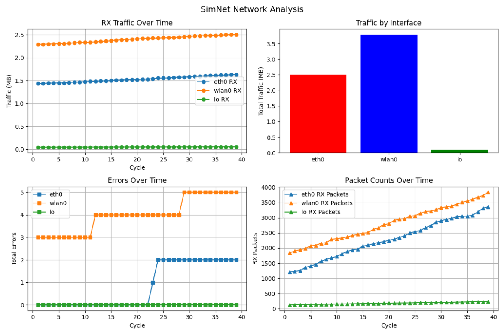

# SimNet Logger

Network interface simulation and analysis tool built with C and Python.

## What It Does

Simulates realistic network traffic across multiple interfaces (eth0, wlan0, lo) and analyzes the data with Python visualizations.

## Technologies

- **C**: Network simulation engine
- **Python**: Data analysis with pandas and matplotlib

## Quick Start

1. **Compile and run simulator**:
   ```bash
   gcc -o simnet_logger simnet_logger.c
   ./simnet_logger
   ```

2. **Install Python requirements**:
   ```bash
   pip install pandas matplotlib
   ```

3. **Analyze data**:
   ```bash
   python3 analyze_simnet.py
   ```

## Output

- `simnet_data.csv` - Network simulation data
- `network_analysis.png` - Traffic and error visualizations  
- Console analysis with interface statistics

### Sample Visualization



*4-panel dashboard showing traffic patterns, interface comparison, error tracking, and packet processing over time.*

## Sample Output

```
=== SimNet Logger - Cycle #25 ===
Interface | Status | RX Bytes  | TX Bytes  | RX Pkts | TX Pkts | Errors
----------|--------|-----------|-----------|---------|---------|--------
eth0      | UP     |   1633504 |    866873 |    2544 |    1434 | 2/0
wlan0     | UP     |   2554357 |   1283584 |    3072 |    1863 | 2/2
lo        | UP     |     50025 |     49969 |     193 |     190 | 0/0
```


---

*Educational project exploring network programming concepts.*
